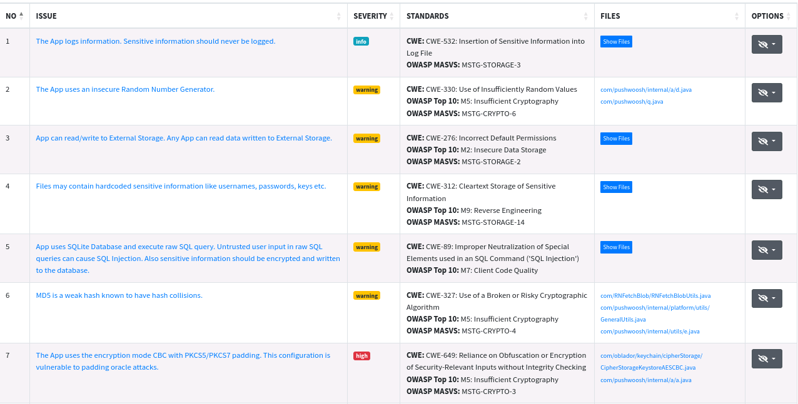

# Procedure Analyse Automatise MobSF
- Une fois que MobSF est installé 
(Lien du repo: https://github.com/mobsf/mobile-security-framework-mobsf)
- On lance MobSF
- On se connecte a l'interface web en localhost
- On importe app.apk dans MobSF

