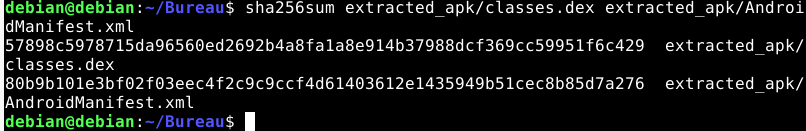

# Procedure Extraction Manifest.xml et classes.dex
- Dézipper app.apk
- Dans le dossier extrait trouvé AndroidManifest.xml et classes.dex
- Récupérer les hash de manifest.xml et classes.dex à l'aide de la commande
```shell
sha256sum classes.dex AndroidManifest.xml
```
