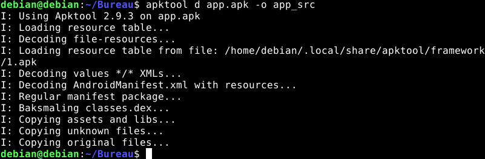

# Procedure ApkTool
- J'installe ApkTool
https://apktool.org/
- Une fois Apktool installé, lancer la commande
```sh
apktool d app.apk -o app_src
```

- On obtient le dossier app_src que l'on zip pour le partager


