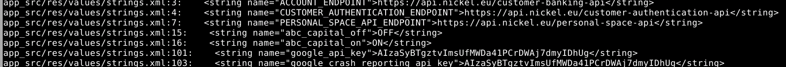

# Procedure recherche strings.xml
- lancer la commande
```shell
find app_src -name "strings.xml" -exec grep -HniE "key|api|token|secret|password" {} \;
```


- Les Strings obtenues ont été résumées dans le fichier : 
strings_findings.md

- A l'aide d'un second outil (OpenFireBase) :
- lancer la commande
```shell
openfirebase -f ~/Bureau/app.apk
```


### Ressource
---
strings_findings.md : 

