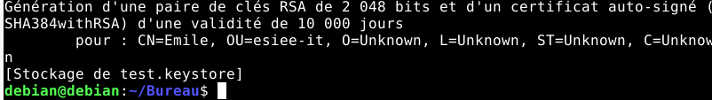
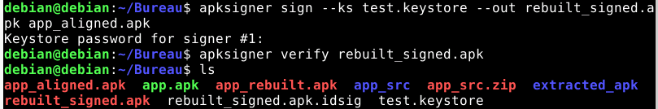
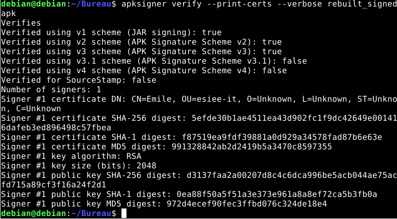

# Procedure de Signature d'APK
- Utiliser la commande
```bash
keytool -genkey -v -keystore test.keystore -alias testkey -keyalg RSA -keysize 2048 -validity 10000
```



- installer l'outil apksigner
https://developer.android.com/tools/apksigner?hl=fr
- Lancer la commande
```bash
apksigner sign --ks test.keystore --out rebuilt_signed.apk app_aligned.apk
```

- Lancer la commande
```bash
apksigner verify --print-certs --verbose rebuilt_signed.apk
```


