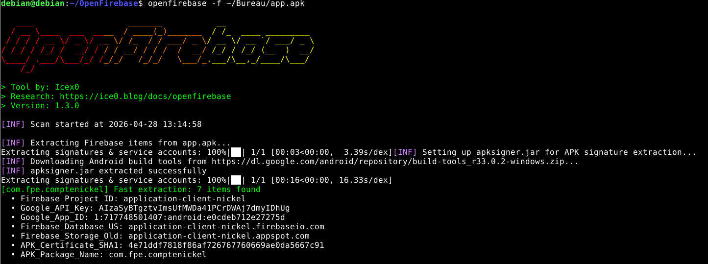
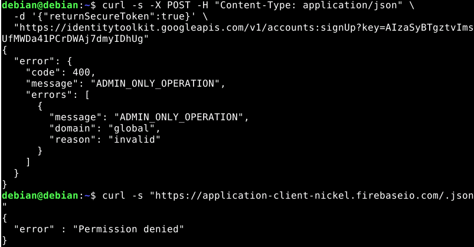

# Procedure de vérification Firebase
- Installer l'outil openfirebase
https://github.com/Icex0/OpenFirebase
- lancer la commande
```shell
openfirebase -f ~/Bureau/app.apk
```


On obtient différentes informations a propos d'une base de données firebase

- On test de curl la base de données



On observe que malgré la connaissance du token, et la connaissance de l'url, nous n'arrivons pas à accéder à la base de données.

La base de données est donc sécurisé mais pas le token d'utilisation, ce qui n'est pas sécurisé.
