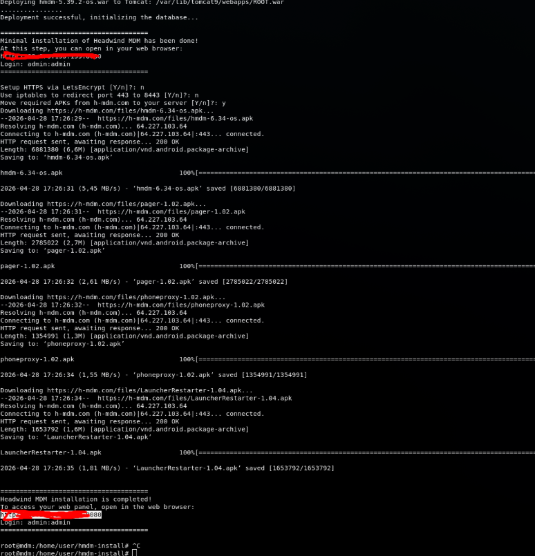
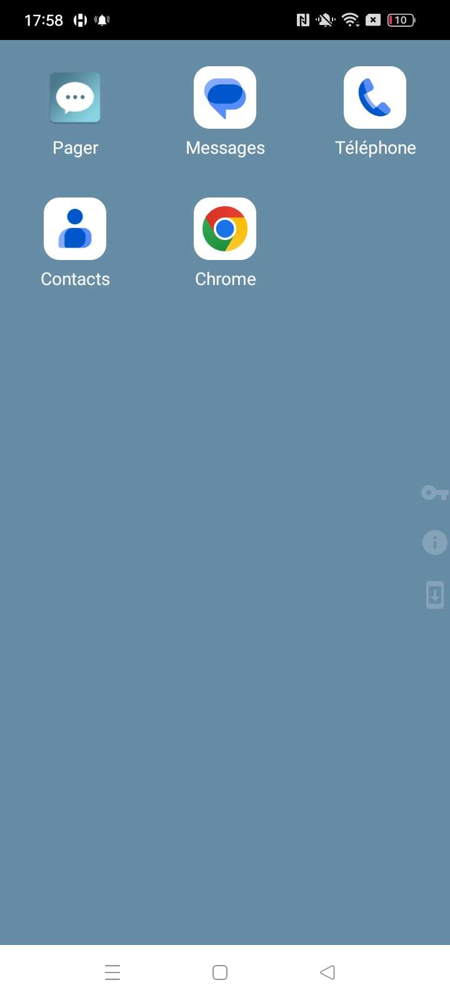
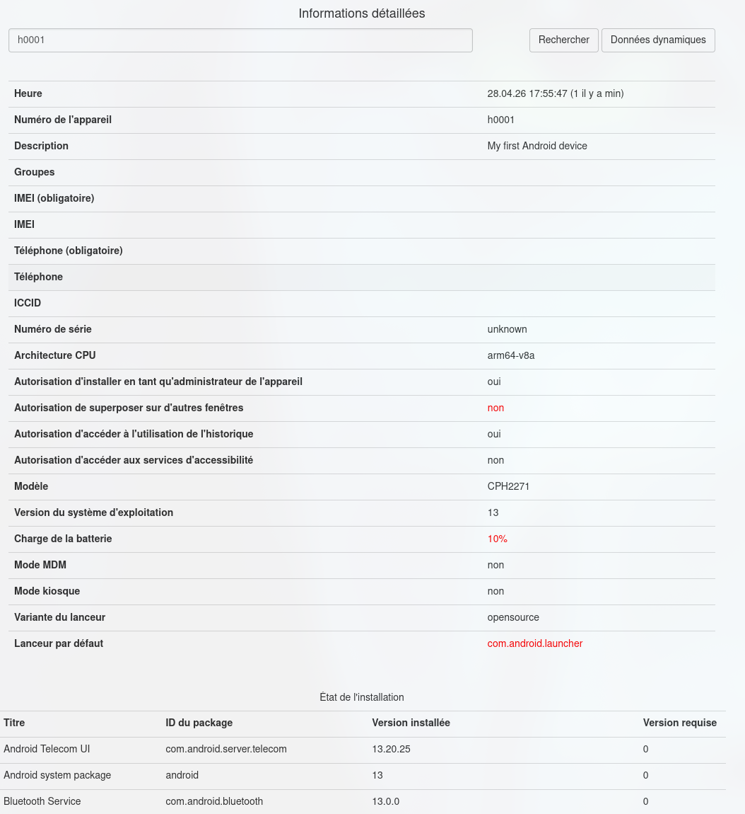
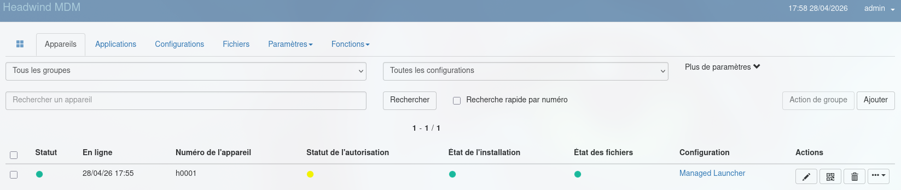

# Procédure Installation MDM et enrolage android

- Installer une solution MDM (Headwind MDM)
https://h-mdm.com/

- Avoir un téléphone android vierge (émulateur)

- Enroler le téléphone dans le MDM

